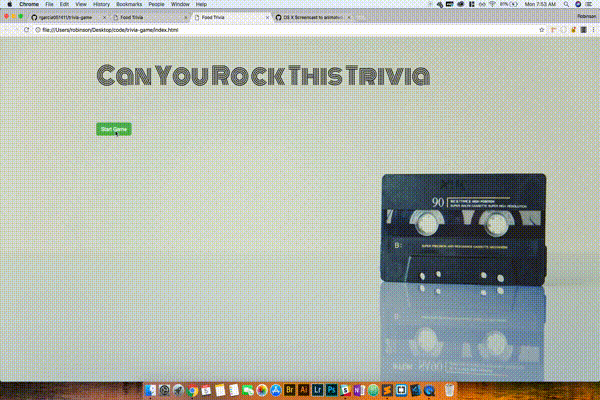

# Trivia Game

This program will allow the user to play trivia. The user has certain amoung of time to answer each question.
## Screen Shot




## Getting Started

These instructions will get you a copy of the project up and running on your local machine for development and testing purposes. See deployment for notes on how to deploy the project on a live system.


## Deployment

```
Github
```
## Technologies used


* JavaScript
* HTML
* JQuery
* CSS
* Bootstrap


## Authors

Robinson Garcia
